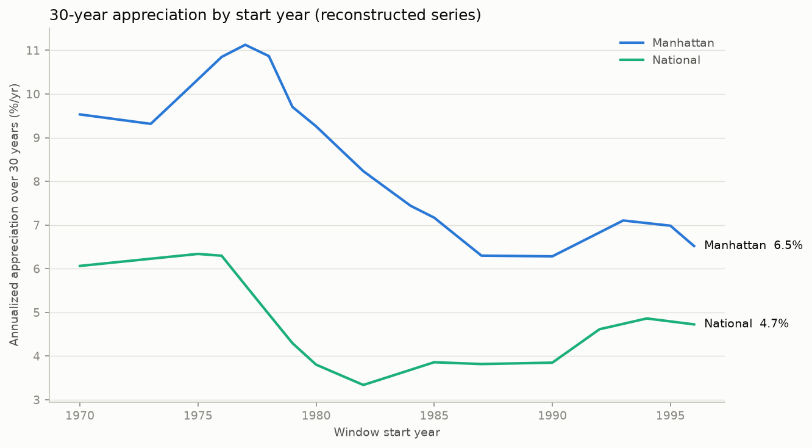

# Rolling 30-year windows: Manhattan vs national, 1970-2026

Built from anchor-reconstructed annual series (`data/manual/*.csv` — every
anchor carries a confidence flag and source note; pre-1989 Manhattan values
are decade-level reconstructions, not survey data).

**Manhattan wins 27 of 27 windows (100%).**
Narrowest margin: 1996-2026 at +1.8 pp/yr.

**Robustness:** in the narrowest window (1996-2026), Manhattan's
cumulative growth multiple is 1.66x the national multiple — the
reconstructed endpoint values would have to be jointly wrong by that factor
(~66%) for the winner to flip. Wider windows need larger errors;
the pre-1989 reconstruction is the least certain but sits in windows with the
largest margins.

| window    |   Manhattan %/yr |   National %/yr |   gap (pp) | winner    |
|:----------|-----------------:|----------------:|-----------:|:----------|
| 1970-2000 |             9.53 |            6.06 |       3.47 | Manhattan |
| 1971-2001 |             9.46 |            6.12 |       3.34 | Manhattan |
| 1972-2002 |             9.39 |            6.17 |       3.21 | Manhattan |
| 1973-2003 |             9.32 |            6.23 |       3.09 | Manhattan |
| 1974-2004 |             9.82 |            6.28 |       3.54 | Manhattan |
| 1975-2005 |            10.34 |            6.34 |       4    | Manhattan |
| 1976-2006 |            10.85 |            6.3  |       4.55 | Manhattan |
| 1977-2007 |            11.13 |            5.63 |       5.5  | Manhattan |
| 1978-2008 |            10.87 |            4.96 |       5.91 | Manhattan |
| 1979-2009 |             9.7  |            4.29 |       5.41 | Manhattan |
| 1980-2010 |             9.26 |            3.8  |       5.46 | Manhattan |
| 1981-2011 |             8.75 |            3.57 |       5.17 | Manhattan |
| 1982-2012 |             8.23 |            3.34 |       4.89 | Manhattan |
| 1983-2013 |             7.84 |            3.51 |       4.32 | Manhattan |
| 1984-2014 |             7.44 |            3.69 |       3.76 | Manhattan |
| 1985-2015 |             7.17 |            3.86 |       3.31 | Manhattan |
| 1986-2016 |             6.73 |            3.84 |       2.89 | Manhattan |
| 1987-2017 |             6.3  |            3.82 |       2.48 | Manhattan |
| 1988-2018 |             6.29 |            3.83 |       2.47 | Manhattan |
| 1989-2019 |             6.29 |            3.84 |       2.45 | Manhattan |
| 1990-2020 |             6.28 |            3.85 |       2.43 | Manhattan |
| 1991-2021 |             6.56 |            4.23 |       2.33 | Manhattan |
| 1992-2022 |             6.83 |            4.61 |       2.22 | Manhattan |
| 1993-2023 |             7.1  |            4.74 |       2.37 | Manhattan |
| 1994-2024 |             7.04 |            4.86 |       2.18 | Manhattan |
| 1995-2025 |             6.98 |            4.79 |       2.19 | Manhattan |
| 1996-2026 |             6.52 |            4.73 |       1.79 | Manhattan |

